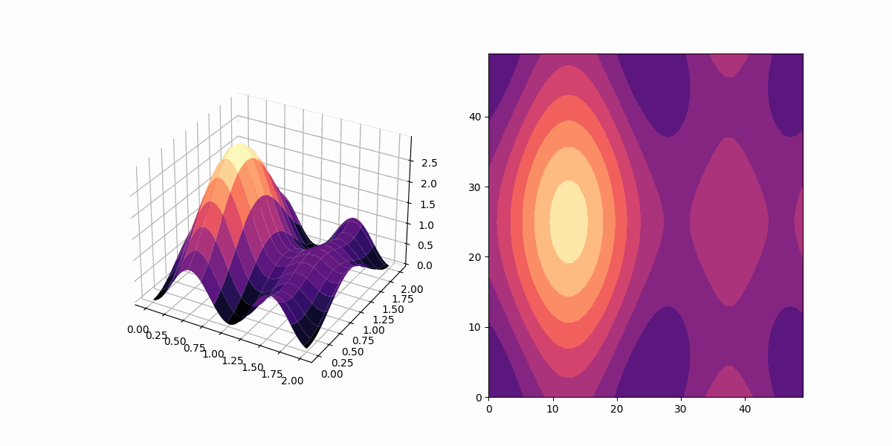

# Particle In Box Simulation Using C Programming
A simple program to using `c programming` to simulate the Quantum Mechanical 
Model *Particle In Box* or **PIB** for short. this is the Solution for the Time 
Dependent Schrodinger Equation for `2 states` as `3D Box`.


## Prerequisites
 1. netCDF4
 2. Python >= 3.7
 3. NumPY
 4. Matplotlib
 5. Pandas

## Build
```sh
$ make
```

## Run
```sh
$ ./bin/PIB.exe
```

## Visualize
```sh
$ python scripts/visualize.py
```

## Demo


## Info
The use of `netCDF4` is know only for storing the dimensions of the variables.
because I had issues storing the data arrays.

## More
You can change the parameters in the `inc/Parameters.h` to change 
the result of the simulation.

